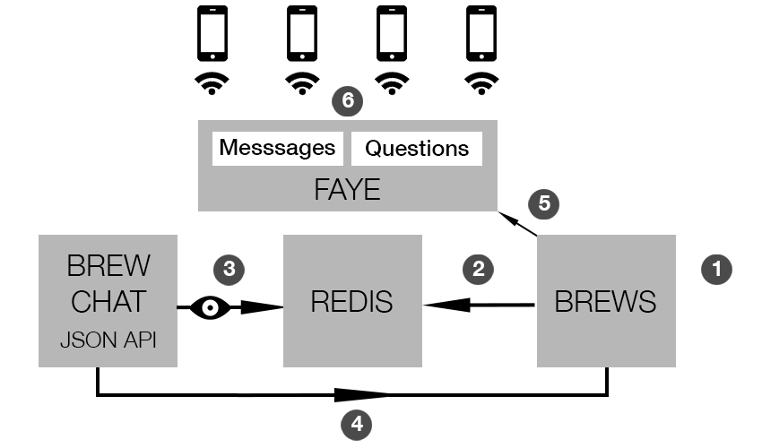

#Brews & Q's

### Play now at! : [Brews' & Q's](http://brewsandqs.com/)

Brews and Q's is a trivia app focused on implementing a services oriented design. The app is targeted at bar and club owners whom want to host trivia competitions easily in their venues. Brews and Q's focuses on making the patron play process as easy as possible. Bar patrons do not have to sign up to play, they only have to use the unique pin for the game to participate which is provided on location.

The application is broken into 4 main parts:

1.  Brews - This is the main app which handles the user interface and question, answer & chat submissions.
2.  Redis - We uses Redis as our chat messages store queue which is watched by the external Brew Chat service API
3.  Brew Chat - Our primary external service, Brew Chat exposes a JSON API which watches the Redis queue for new chat message data with which it can create new chat messages.
4.  Faye - Handles the subscription to messages returned to the Brew's app, via Brew Chat, and then publishes them to the patron client devices

The app will has three core functions:

* Trivia Masters: Can host trivia sessions by creating new games with their own trivia questions 
* Trivia Participants: Bar patrons will be able to participate in these games with their smartphones
* Big Screen Projectiomn: Trivia Masters can display trivia game details on a big screen at their venue via their Brew's & Q's admin view.

Application flow as per the diagram:

1. Brew App
  * Trivia Masters: Sign-up to the application so that they can host a trivia game and create a unique participation pin for it. They can add questions and assign point values to them. When ready they can start the game, at which point they can release questions to the game participants. They can also set up their big screen functionality to communicate the game pin to the patrons.
  * Trivia Patrons: Bar patrons need just visit the site and enter a team name and the unique pin provided on location to participate in the game. They can add messages to the game chat and submit answers to the questions.
2. Redis
  * When a user submits a chat message to the Brews app it is added to the Redis store queue, where it will wait to be read by the Brew Chat app.
3. Brew Chat
  * Reads the redis queue and writes new chat messages.
4. Brews
  * Reads the messages created by the Brew Chat application
5. Brews - Faye
  * Faye subscribes to the Brews application to read new chat messages which it then publishes to the patron clients.
  * When trivia masters update the current question, Faye listens for this event and then updates the patron clients view automatically without the need for a browser refresh.

***
To run Brews and Q's locally:

* Clone down the brews app
  * visit [Brews Repo](https://github.com/phoenixbox/brews)
  * From the command line prompt:
  * git clone https://github.com/phoenixbox/brews.git
  * cd into the brews directory
  * bundle install
  * rake db:migrate db:test:prepare
  * Run the app on **port 3001**: rails s -p 3001
* Clone down the brews chat app
  * visit [Brew Chat Repo](https://github.com/phoenixbox/brew_chat)
  * From the command line prompt:
  * git clone https://github.com/phoenixbox/brew_chat.git
  * cd into brew_chat directory
  * bundle install
  * rake db:migrate db:test:prepare
  * Run the app on **port 300**: rails s
* Visit localhost:3000 and then have fun with the game!
* To simulate multiple user interactions use either
  * Chrome incognitio browser windows or
  * Add multiple Chrome users via Chrome Preferences
* Thanks for checking out Brew's & Q's!